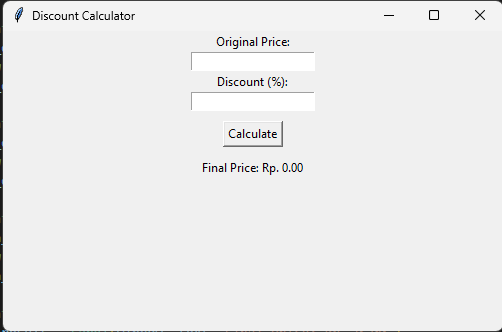

# 💰 Discount Calculator with Tkinter

A simple GUI-based desktop application for calculating the final price after a discount. This project was created using Python and the standard Tkinter library.

---

## ✨ Feature
- Automatically calculates the total discount amount.
- Displays the final price with two decimal places.
- Equipped with **Error Handling** to prevent crashes if the input is not a number.
- Simple and easy-to-use graphical user interface (GUI).

---

## 📸 Application Display

Here is a preview of the Discount Calculator application:

---

### 📄 Requirement

* The latest version of Python.
* Tkinter (already available in Python's standard library).

---

### 🛠 Installation

1. Clone or download the GitHub repository.
2. Ensure that the latest version of Python is installed on your device.

---

## 🚀 Usage

**1. Use the command below on your terminal to run the code.**

    py main.py
    
**2. Enter the original price and promo price, making sure to only enter numbers.**

**3. Press the Calculate button.**

**4. The price after the promo will be displayed on the screen.**

---
### 📄 License
Distributed under the **[MIT License](LICENSE.md)** for full details.

Copyright © 2026 Fadhil Firoos
